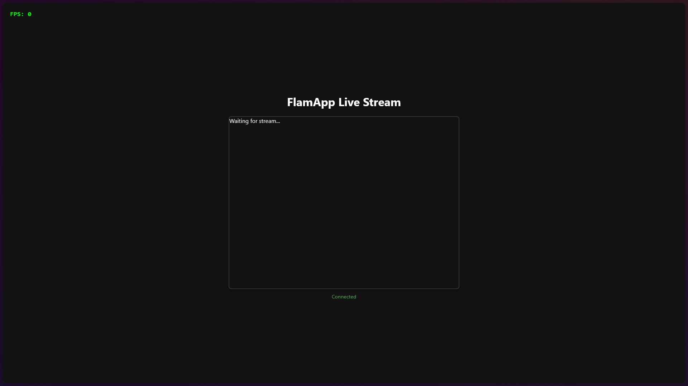
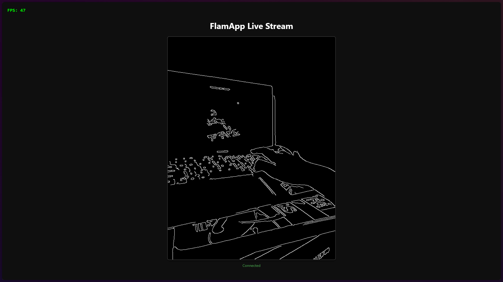
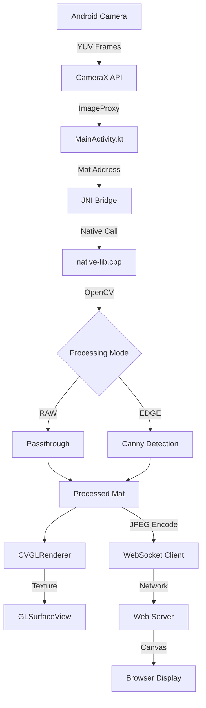

# FlamApp - Real-Time Edge Detection Viewer

A cross-platform computer vision application that captures camera frames on Android, processes them using OpenCV in C++ via JNI, renders with OpenGL ES, and streams to a TypeScript web viewer in real-time.

---

## 📱 Screenshots & Demo

### Android Application


*App in idle state with camera feed*


*Mobile interface showing edge detection controls*


*Real-time streaming with edge detection processing*

---

## ✨ Features

### Android Application

- ✅ **Real-Time Camera Capture** - CameraX API with YUV_420_888 format
- ✅ **Dual Processing Modes**
  - **RAW Mode** - Direct camera feed passthrough
  - **Edge Detection Mode** - Canny edge detection with adjustable thresholds
- ✅ **Native C++ Processing** - High-performance OpenCV operations via JNI
- ✅ **OpenGL ES 2.0 Rendering** - Hardware-accelerated texture display
- ✅ **Dynamic Threshold Control** - Real-time SeekBar sliders (Low: 0-200, High: 0-300)
- ✅ **FPS Monitoring** - Live performance metrics
- ✅ **WebSocket Streaming** - JPEG-encoded frame transmission to web viewer
- ✅ **Automatic Rotation Handling** - Correct orientation for all camera angles
- ✅ **Frame Rate Optimization** - Configurable frame skipping for efficient streaming

### Web Viewer

- ✅ **TypeScript Implementation** - Type-safe WebSocket client
- ✅ **Real-Time Display** - Canvas-based frame rendering
- ✅ **Connection Status** - Visual indicators for stream health
- ✅ **Resolution Display** - Dynamic frame dimension tracking
- ✅ **FPS Counter** - Client-side performance monitoring
- ✅ **Responsive UI** - Modern web interface with controls

---

## 🏗️ Architecture

### System Overview



### Frame Flow Pipeline

1. **Capture Layer** (Kotlin)
   - `CameraX` captures frames in YUV_420_888 format
   - Y plane extracted as grayscale (CV_8UC1)
   - Rotation applied based on device orientation

2. **JNI Bridge** (Kotlin ↔ C++)
   - Mat memory addresses passed via `nativeObjAddr`
   - Two native methods:
     - `nativeProcessFrame()` - Canny edge detection
     - `nativePassthrough()` - Direct copy for RAW mode

3. **Processing Layer** (C++)
   - **Gaussian Blur** - 5x5 kernel, σ=1.5 (noise reduction)
   - **Canny Edge Detection** - Dynamic thresholds from UI sliders
   - Zero-copy operations using Mat pointers

4. **Rendering Layer** (OpenGL ES)
   - `CVGLRenderer` converts Mat to GL texture
   - Fragment shader displays grayscale/edge data
   - `RENDERMODE_WHEN_DIRTY` for efficiency

5. **Streaming Layer** (WebSocket)
   - JPEG encoding via `Imgcodecs.imencode()`
   - Frame skipping (every 3rd frame) to reduce bandwidth
   - OkHttp WebSocket client with auto-reconnect

6. **Web Display** (TypeScript)
   - WebSocket server receives binary JPEG data
   - Canvas 2D context renders decoded frames
   - FPS calculation and UI updates

### Component Interaction

```
┌─────────────────────────────────────────────────────────┐
│                    Android Application                   │
├─────────────────────────────────────────────────────────┤
│                                                           │
│  ┌──────────────┐      ┌─────────────────────────────┐  │
│  │ MainActivity │◄────►│ CVGLRenderer                │  │
│  │  (Kotlin)    │      │ (OpenGL ES)                 │  │
│  └──────┬───────┘      └─────────────────────────────┘  │
│         │                                                │
│         │ JNI Call (Mat addresses)                       │
│         ▼                                                │
│  ┌──────────────────────────────────────────────────┐   │
│  │ native-lib.cpp (C++)                             │   │
│  │ ┌──────────────┐  ┌────────────────────────────┐ │   │
│  │ │ Gaussian     │─►│ Canny Edge Detection       │ │   │
│  │ │ Blur         │  │ (lowThreshold, highThresh) │ │   │
│  │ └──────────────┘  └────────────────────────────┘ │   │
│  └──────────────────────────────────────────────────┘   │
│         │                                                │
│         │ Processed Mat                                  │
│         ▼                                                │
│  ┌──────────────────────────────────────────────────┐   │
│  │ StreamClient (WebSocket)                         │   │
│  │ - JPEG Encoding                                  │   │
│  │ - Frame Skipping                                 │   │
│  └──────────────────────────────────────────────────┘   │
│         │                                                │
└─────────┼────────────────────────────────────────────────┘
          │ WebSocket (Binary JPEG)
          ▼
┌─────────────────────────────────────────────────────────┐
│                    Web Viewer (TypeScript)               │
├─────────────────────────────────────────────────────────┤
│  ┌──────────────────────────────────────────────────┐   │
│  │ WebSocket Server (ws://0.0.0.0:8080)            │   │
│  └──────────────────────────────────────────────────┘   │
│         │                                                │
│         │ Decoded JPEG                                   │
│         ▼                                                │
│  ┌──────────────────────────────────────────────────┐   │
│  │ Canvas Renderer                                  │   │
│  │ - Image decoding                                 │   │
│  │ - FPS calculation                                │   │
│  │ - UI updates                                     │   │
│  └──────────────────────────────────────────────────┘   │
└─────────────────────────────────────────────────────────┘
```

### Key Technologies

| Layer | Technology | Purpose |
|-------|-----------|---------|
| **Camera** | CameraX API | Modern camera lifecycle management |
| **UI** | View Binding, SeekBar | Type-safe UI controls |
| **Graphics** | OpenGL ES 2.0 | Hardware-accelerated rendering |
| **Native Bridge** | JNI (Java Native Interface) | Kotlin ↔ C++ communication |
| **Image Processing** | OpenCV 4.x | Canny edge detection, Gaussian blur |
| **Build System** | CMake, NDK | Native library compilation |
| **Networking** | OkHttp WebSocket | Real-time frame streaming |
| **Web Server** | Node.js + ws library | WebSocket server |
| **Web Client** | TypeScript, Canvas API | Browser-based viewer |

---

## 📦 Setup Instructions

### Prerequisites

| Requirement | Version | Installation |
|------------|---------|--------------|
| **Android Studio** | Latest (Hedgehog+) | [Download](https://developer.android.com/studio) |
| **Android NDK** | 25.x+ | SDK Manager → SDK Tools → NDK |
| **CMake** | 3.22+ | SDK Manager → SDK Tools → CMake |
| **OpenCV Android SDK** | 4.8.0+ | [Download](https://opencv.org/releases/) |
| **Node.js** | 18+ | [Download](https://nodejs.org/) |
| **Android Device/Emulator** | API 24+ | Physical device recommended |

### Step 1: OpenCV Android SDK Setup

1. **Download OpenCV**
   ```bash
   # Download from https://opencv.org/releases/
   # Extract to a permanent location, e.g.:
   # C:\opencv\OpenCV-android-sdk (Windows)
   # ~/opencv/OpenCV-android-sdk (macOS/Linux)
   ```

2. **Configure Local Properties**
   
   Create `android/local.properties` (if it doesn't exist):
   
   **Windows:**
   ```properties
   sdk.dir=C:\\Users\\YourUsername\\AppData\\Local\\Android\\Sdk
   opencv.dir=C:\\opencv\\OpenCV-android-sdk
   ```
   
   **macOS/Linux:**
   ```properties
   sdk.dir=/Users/YourUsername/Library/Android/sdk
   opencv.dir=/Users/YourUsername/opencv/OpenCV-android-sdk
   ```

3. **Verify OpenCV Structure**
   ```
   OpenCV-android-sdk/
   ├── sdk/
   │   ├── native/
   │   │   ├── jni/
   │   │   │   └── include/  # C++ headers
   │   │   └── libs/         # .so files
   │   └── java/             # OpenCV Java wrapper
   ```

### Step 2: Build Android Application

1. **Open Project**
   ```bash
   # Open Android Studio
   # File → Open → Select 'android' directory
   ```

2. **Gradle Sync**
   - Wait for Gradle to sync dependencies
   - Resolve any SDK/NDK version prompts
   - Ensure CMake is installed via SDK Manager

3. **Configure Device**
   
   **Physical Device:**
   - Enable Developer Options (tap Build Number 7 times)
   - Enable USB Debugging
   - Connect via USB
   - Authorize computer when prompted
   
   **Emulator:**
   - Create AVD with API 24+ and camera support
   - Use x86_64 image for better performance

4. **Build & Run**
   ```bash
   # Via Android Studio: Click Run (▶) button
   # Or via command line:
   cd android
   ./gradlew installDebug  # macOS/Linux
   gradlew.bat installDebug  # Windows
   ```

5. **Grant Permissions**
   - Allow camera permission when prompted
   - App will start capturing immediately

### Step 3: Run Web Viewer

1. **Install Dependencies**
   ```bash
   cd web
   npm install
   ```

2. **Start Server**
   ```bash
   npm run dev
   # Server starts on http://localhost:8080
   ```

3. **Access Viewer**
   - Open browser to `http://localhost:8080`
   - You should see the viewer interface with "Disconnected" status

### Step 4: Connect Android to Web Viewer

1. **Find Your Computer's IP Address**
   
   **Windows:**
   ```powershell
   ipconfig
   # Look for "IPv4 Address" under your active network adapter
   ```
   
   **macOS/Linux:**
   ```bash
   ifconfig
   # Look for "inet" under en0 or wlan0
   ```

2. **Update Android App**
   
   Edit `android/app/src/main/java/com/example/cvgl/MainActivity.kt`:
   ```kotlin
   // Line ~78
   val serverUrl = "ws://YOUR_COMPUTER_IP:8080"
   // Example: "ws://192.168.1.100:8080"
   ```
   
   **For Android Emulator:**
   ```kotlin
   val serverUrl = "ws://10.0.2.2:8080"  // Special alias for host machine
   ```

3. **Rebuild & Run**
   - Rebuild the Android app
   - Launch on device/emulator
   - Web viewer should show "Connected" status
   - Frames should appear in the canvas

### Step 5: Verify Installation

**Android App Checklist:**
- [ ] Camera preview visible in GLSurfaceView
- [ ] FPS counter updating (should be 20-30 FPS)
- [ ] Mode toggle switches between RAW/EDGE DETECTION
- [ ] Sliders adjust edge detection thresholds
- [ ] No crashes or errors in Logcat

**Web Viewer Checklist:**
- [ ] Status shows "Connected"
- [ ] Canvas displays frames from Android
- [ ] FPS counter updating
- [ ] Resolution matches camera output

---

## 🎮 Usage Guide

### Android Controls

| Control | Function | Range |
|---------|----------|-------|
| **Toggle Mode** | Switch RAW ↔ EDGE DETECTION | - |
| **Low Threshold** | Edge sensitivity (lower = more edges) | 0-200 |
| **High Threshold** | Edge strength (higher = stronger edges) | 0-300 |
| **Stop Stream** | Pause WebSocket transmission | - |
| **Reset App** | Restart application | - |

### Optimal Settings

**Well-Lit Environment:**
- Low Threshold: 80-120
- High Threshold: 200-250

**Low Light:**
- Low Threshold: 20-50
- High Threshold: 60-120

**General Rule:**
- High Threshold should be 2-3× Low Threshold
- Adjust based on scene complexity

---

## 🔧 Development

### Project Structure

```
flamapp/
├── android/
│   ├── app/
│   │   ├── src/main/
│   │   │   ├── java/com/example/cvgl/
│   │   │   │   ├── MainActivity.kt          # Main activity, camera setup
│   │   │   │   ├── CVGLRenderer.kt          # OpenGL ES renderer
│   │   │   │   └── StreamClient.kt          # WebSocket client
│   │   │   ├── cpp/
│   │   │   │   └── native-lib.cpp           # OpenCV processing (JNI)
│   │   │   ├── res/
│   │   │   │   └── layout/
│   │   │   │       └── activity_main.xml    # UI layout
│   │   │   └── AndroidManifest.xml
│   │   ├── build.gradle.kts                 # App-level Gradle config
│   │   └── CMakeLists.txt                   # Native build config
│   ├── build.gradle.kts                     # Project-level Gradle
│   └── local.properties                     # SDK/OpenCV paths (gitignored)
├── web/
│   ├── src/
│   │   └── main.ts                          # WebSocket server + UI logic
│   ├── index.html                           # Web viewer UI
│   ├── package.json
│   └── tsconfig.json
├── Screenshots/                             # Visual documentation
├── .gitignore
└── README.md
```

### Build Configuration

**CMakeLists.txt** - Native library compilation:
```cmake
cmake_minimum_required(VERSION 3.22.1)
project("cvgl")

# OpenCV paths from local.properties
set(OpenCV_DIR ${OPENCV_DIR}/sdk/native/jni)
find_package(OpenCV REQUIRED)

add_library(cvgl SHARED native-lib.cpp)
target_link_libraries(cvgl ${OpenCV_LIBS} log)
```

**build.gradle.kts** - Android configuration:
```kotlin
android {
    ndkVersion = "25.2.9519653"
    externalNativeBuild {
        cmake {
            path = file("CMakeLists.txt")
            arguments += "-DOPENCV_DIR=${project.properties["opencv.dir"]}"
        }
    }
}
```

### Key Dependencies

**Android:**
- `androidx.camera:camera-camera2:1.3.0`
- `androidx.camera:camera-lifecycle:1.3.0`
- `com.squareup.okhttp3:okhttp:4.12.0`

**Web:**
- `ws` - WebSocket server
- `typescript` - Type safety
- `vite` - Development server

---

## 🐛 Troubleshooting

### OpenCV Issues

**Error: `opencv.dir` not found**
```bash
# Solution: Verify local.properties path
cat android/local.properties
# Ensure opencv.dir points to extracted SDK
```

**Error: `libopencv_java4.so` not found**
```bash
# Solution: Check OpenCV SDK structure
ls $OPENCV_DIR/sdk/native/libs/arm64-v8a/
# Should contain libopencv_java4.so
```

### Build Errors

**CMake Error: OpenCV not found**
```bash
# Solution: Clean and rebuild
cd android
./gradlew clean
./gradlew build
```

**NDK Version Mismatch**
```bash
# Solution: Update NDK in Android Studio
# SDK Manager → SDK Tools → NDK (Side by side)
# Update build.gradle.kts ndkVersion to match
```

### Runtime Issues

**Camera Permission Denied**
- Uninstall app
- Reinstall and grant permission immediately

**WebSocket Connection Failed**
- Verify IP address in `MainActivity.kt`
- Check firewall settings (allow port 8080)
- Ensure web server is running (`npm run dev`)
- For emulator, use `10.0.2.2` instead of `localhost`

**Low FPS (<10)**
- Reduce camera resolution in CameraX config
- Increase `STREAM_SKIP_FRAMES` value
- Test on physical device (emulator is slower)

**Black Screen on GLSurfaceView**
- Check Logcat for OpenGL errors
- Verify Mat data is not empty
- Ensure correct texture format (GL_LUMINANCE)

---

## 📚 Technical Details

### JNI Method Signatures

```cpp
// Canny edge detection with dynamic thresholds
JNIEXPORT void JNICALL
Java_com_example_cvgl_MainActivity_nativeProcessFrame(
    JNIEnv* env,
    jobject thiz,
    jlong matAddrInput,    // Input Mat memory address
    jlong matAddrOutput,   // Output Mat memory address
    jint lowThreshold,     // Canny low threshold (0-200)
    jint highThreshold     // Canny high threshold (0-300)
);

// Passthrough for RAW mode
JNIEXPORT void JNICALL
Java_com_example_cvgl_MainActivity_nativePassthrough(
    JNIEnv* env,
    jobject thiz,
    jlong matAddrInput,
    jlong matAddrOutput
);
```

### OpenCV Pipeline

```cpp
// 1. Gaussian Blur (noise reduction)
cv::GaussianBlur(matInput, blurred, cv::Size(5, 5), 1.5);

// 2. Canny Edge Detection
cv::Canny(blurred, matOutput, lowThreshold, highThreshold);
```

### WebSocket Protocol

**Frame Format:**
- Binary JPEG data
- Typical size: 10-50 KB per frame
- Frame rate: ~10 FPS (every 3rd camera frame)

**Connection Flow:**
1. Android connects to `ws://IP:8080`
2. Web server accepts connection
3. Android sends JPEG frames
4. Web decodes and renders to canvas

---

## 📄 License

Educational/Assessment Project

---

## 🙏 Acknowledgments

- **OpenCV** - Computer vision library
- **CameraX** - Android camera API
- **OkHttp** - WebSocket client
- **TypeScript** - Type-safe web development
