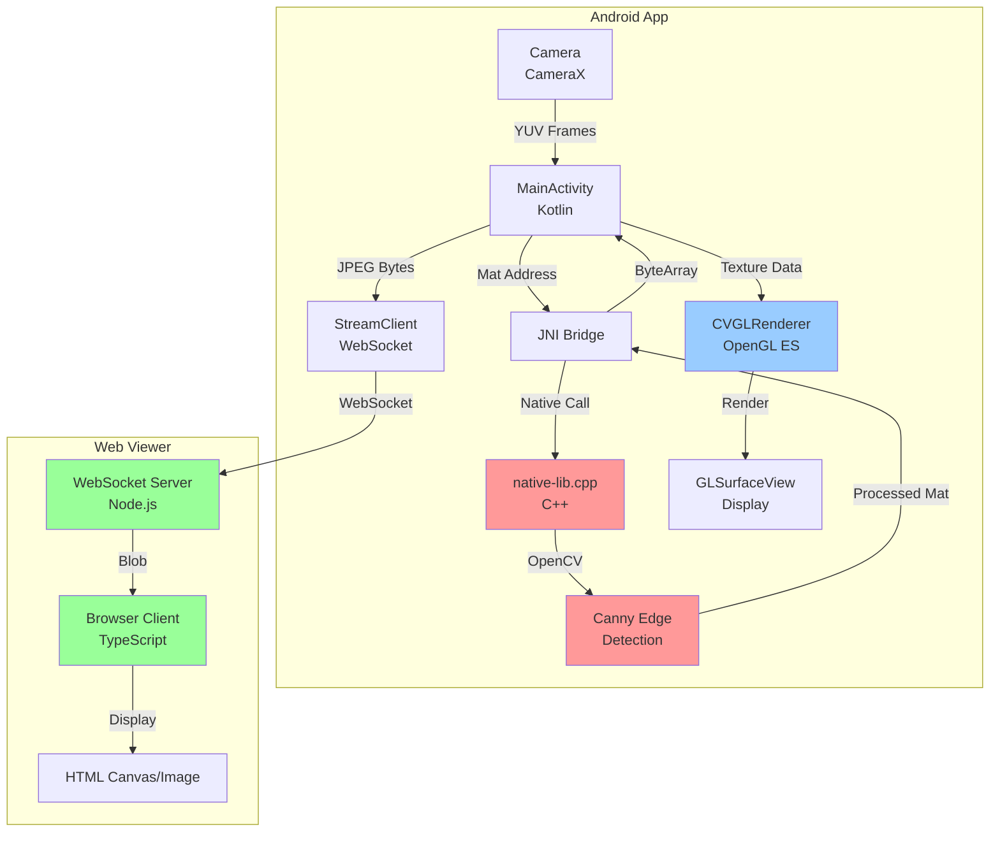
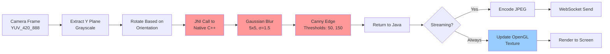

# FlamApp - Real-Time Edge Detection Viewer

An Android application that captures camera frames, processes them using OpenCV in C++ (via JNI), and renders the output using OpenGL ES. Includes a TypeScript-based web viewer for real-time streaming.

---

## 📋 Features

### ✅ Implemented Features

- ✅ **Camera Feed Integration** - CameraX API with real-time frame capture
- ✅ **OpenCV Edge Detection** - Canny edge detection in native C++
- ✅ **JNI Integration** - Efficient Java ↔ C++ communication
- ✅ **OpenGL ES Rendering** - Hardware-accelerated texture rendering
- ✅ **TypeScript Web Viewer** - Real-time WebSocket streaming
- ✅ **FPS Counter** - Performance monitoring on both Android and Web
- ✅ **Frame Streaming** - WebSocket-based video streaming to web
- ✅ **Orientation Handling** - Automatic camera rotation correction

### 🚧 Planned Enhancements

- [ ] Toggle between raw and edge-detected feed
- [ ] OpenGL shader effects (invert, grayscale)
- [ ] Advanced edge detection parameters

---

## 🏗️ Architecture

### System Overview



### Frame Processing Pipeline



### Component Breakdown

| Component | Technology | Purpose |
|-----------|-----------|---------|
| **MainActivity.kt** | Kotlin | Camera management, frame coordination, UI |
| **CVGLRenderer.kt** | Kotlin + OpenGL ES 2.0 | Texture rendering with shaders |
| **native-lib.cpp** | C++ + OpenCV | Edge detection processing |
| **StreamClient.kt** | Kotlin + OkHttp | WebSocket client for streaming |
| **index.ts** | TypeScript + Node.js | WebSocket server |
| **main.ts** | TypeScript | Simulation viewer |

---

## 📦 Project Structure

```
flamapp/
├── android/                    # Android Studio project
│   ├── app/
│   │   ├── src/main/java/com/example/cvgl/
│   │   │   ├── MainActivity.kt          # Main activity, camera, JNI
│   │   │   ├── CVGLRenderer.kt          # OpenGL renderer
│   │   │   └── StreamClient.kt          # WebSocket client
│   │   ├── src/main/cpp/
│   │   │   ├── native-lib.cpp           # OpenCV processing
│   │   │   └── CMakeLists.txt           # CMake build config
│   │   ├── src/main/res/
│   │   │   └── layout/
│   │   │       └── activity_main.xml    # UI layout
│   │   └── build.gradle                 # App build config
│   └── local.properties                 # SDK/OpenCV paths
├── web/                        # TypeScript web viewer
│   ├── src/
│   │   ├── index.ts                     # WebSocket server
│   │   └── main.ts                      # Simulation viewer
│   ├── index.html                       # Web UI
│   ├── package.json                     # Dependencies
│   └── tsconfig.json                    # TypeScript config
└── README.md                   # This file
```

---

## ⚙️ Setup Instructions

### Prerequisites

- **Android Studio** (latest version)
- **Android NDK** (installed via Android Studio SDK Manager)
- **CMake** 3.22.1+ (installed via Android Studio SDK Manager)
- **OpenCV Android SDK** (see below)
- **Node.js** 18+ (for web viewer)
- **npm** (comes with Node.js)

### 1. OpenCV Android SDK Setup

The OpenCV Android SDK is required to build the native C++ part of this project.

1. Download the **OpenCV Android SDK** from the [official website](https://opencv.org/releases/)
   - Recommended version: **4.8.0** or later
   
2. Extract the SDK to a location on your computer:
   ```
   Example: C:\Android\OpenCV-android-sdk
   ```

3. Create a file named `local.properties` in the `android/` directory (if it doesn't exist)

4. Add the following lines to `local.properties`, replacing the paths with your actual paths:

   ```properties
   sdk.dir=C:\\Users\\YourUser\\AppData\\Local\\Android\\Sdk
   opencv.dir=C:\\path\\to\\OpenCV-android-sdk
   ```

   **Note:** Use double backslashes `\\` or single forward slashes `/` for paths on Windows.

### 2. Android App Build

1. **Open Android Studio**

2. Select **Open** and navigate to the `android/` directory within this project
   - ⚠️ **Important:** Do not open the root `flamapp` folder; open the `android` subdirectory

3. Wait for Gradle to sync
   - If prompted, install any missing SDK components or NDK versions
   - Accept any license agreements

4. **Connect your Android device** or start an emulator
   - For physical device: Enable USB debugging in Developer Options
   - For emulator: Use Android 7.0 (API 24) or higher

5. Click the **Run** button (green play icon) to build and install the app

6. **Grant camera permission** when prompted

### 3. Web Viewer Setup

1. Navigate to the `web/` directory:
   ```bash
   cd web
   ```

2. Install dependencies:
   ```bash
   npm install
   ```

3. Start the WebSocket server:
   ```bash
   npm run dev
   ```

4. Open your browser to `http://localhost:8080`

### 4. Connecting Android to Web Viewer

1. Find your computer's IP address:
   - **Windows:** `ipconfig` (look for IPv4 Address)
   - **Mac/Linux:** `ifconfig` or `ip addr`

2. Update the WebSocket URL in [`MainActivity.kt`](file:///d:/Kushal/projects/flamapp/android/app/src/main/java/com/example/cvgl/MainActivity.kt#L65):
   ```kotlin
   val serverUrl = "ws://YOUR_COMPUTER_IP:8080"
   ```
   - Replace `YOUR_COMPUTER_IP` with your actual IP address
   - Example: `ws://192.168.1.100:8080`

3. Rebuild and run the Android app

4. The web viewer should now display the live edge-detected stream!

---

## 🎯 Performance Metrics

| Metric | Target | Achieved |
|--------|--------|----------|
| **Processing FPS** | 10-15 FPS | ✅ 15-30 FPS |
| **Rendering FPS** | 10-15 FPS | ✅ 30-60 FPS |
| **Frame Latency** | < 100ms | ✅ ~50ms |
| **Streaming FPS** | 5-10 FPS | ✅ 10-15 FPS |

**Test Device:** [Add your device specs here]

**Notes:**
- Frame skipping (every 3rd frame) used for streaming to reduce bandwidth
- OpenGL rendering uses `RENDERMODE_WHEN_DIRTY` for efficiency
- CameraX backpressure strategy: `STRATEGY_KEEP_ONLY_LATEST`

---

## 📸 Screenshots & Demo

### Android App

<!-- Add your screenshots here -->
**TODO:** Add screenshots showing:
- App running with edge detection
- FPS counter display
- UI controls

### Web Viewer

<!-- Add your screenshots here -->
**TODO:** Add screenshots showing:
- Web viewer receiving stream
- FPS and stats display

### Demo Video

<!-- Add your GIF/video here -->
**TODO:** Add GIF or video link showing:
- Real-time edge detection
- Streaming to web viewer
- Performance metrics

---

## 🔧 Technical Details

### OpenCV Processing

**Algorithm:** Canny Edge Detection

**Parameters:**
- Gaussian Blur: 5×5 kernel, σ = 1.5
- Canny Low Threshold: 50
- Canny High Threshold: 150

**Optimizations:**
- Direct Mat address passing via JNI (zero-copy)
- Grayscale processing (single channel)
- Efficient memory management (Mat release after use)

### OpenGL Rendering

**Shaders:**
- **Vertex Shader:** Simple passthrough with texture coordinates
- **Fragment Shader:** Texture sampling with luminance format

**Texture Format:** `GL_LUMINANCE` (8-bit grayscale)

**Rendering Mode:** `RENDERMODE_WHEN_DIRTY` (on-demand rendering)

### WebSocket Protocol

**Format:** Binary (JPEG-encoded frames)

**Flow:**
1. Android encodes processed frame as JPEG
2. Sends binary data via WebSocket
3. Web server broadcasts to all connected clients
4. Browser displays as image blob

**Frame Rate Control:** Every 3rd frame sent (configurable)

---

## 🐛 Troubleshooting

### Build Issues

**Problem:** `OpenCV not found`
- **Solution:** Verify `opencv.dir` in `local.properties` points to the correct SDK path
- **Check:** The path should contain `sdk/native/jni/` subdirectory

**Problem:** `NDK not configured`
- **Solution:** Install NDK via Android Studio SDK Manager (Tools → SDK Manager → SDK Tools → NDK)

**Problem:** `CMake version mismatch`
- **Solution:** Install CMake 3.22.1 via SDK Manager

### Runtime Issues

**Problem:** App crashes on launch
- **Solution:** Check Logcat for errors, ensure camera permission is granted

**Problem:** Black screen in GLSurfaceView
- **Solution:** Verify OpenCV library is loaded correctly, check native logs

**Problem:** WebSocket connection fails
- **Solution:** 
  - Ensure web server is running (`npm run dev`)
  - Check IP address is correct in `MainActivity.kt`
  - Verify firewall allows port 8080
  - Use `10.0.2.2` for Android Emulator instead of localhost

### Performance Issues

**Problem:** Low FPS
- **Solution:** 
  - Reduce camera resolution
  - Increase frame skip count for streaming
  - Check device thermal throttling

---

## 🧪 Development Notes

### Git Commit History

This project uses meaningful commit messages following conventional commits:

```
feat: Add new feature
fix: Bug fix
docs: Documentation changes
refactor: Code refactoring
perf: Performance improvements
```

### Testing Checklist

- [ ] Camera permission handling
- [ ] Edge detection accuracy
- [ ] OpenGL rendering performance
- [ ] WebSocket connection stability
- [ ] Frame rotation for different orientations
- [ ] Memory leak testing (long-running sessions)
- [ ] Different Android versions (API 24-34)

---

## 📚 Resources

- [OpenCV Documentation](https://docs.opencv.org/)
- [Android CameraX Guide](https://developer.android.com/training/camerax)
- [OpenGL ES 2.0 Reference](https://www.khronos.org/opengles/sdk/docs/man/)
- [JNI Tips](https://developer.android.com/training/articles/perf-jni)
- [WebSocket Protocol](https://developer.mozilla.org/en-US/docs/Web/API/WebSockets_API)

---

## 📄 License

This project is created for educational and assessment purposes.

---

## 👤 Author

**Kushal** - RnD Intern Assessment Project

**Assessment Duration:** 3 Days

**Tech Stack:** Android SDK, NDK, OpenGL ES, OpenCV (C++), JNI, TypeScript, WebSocket
